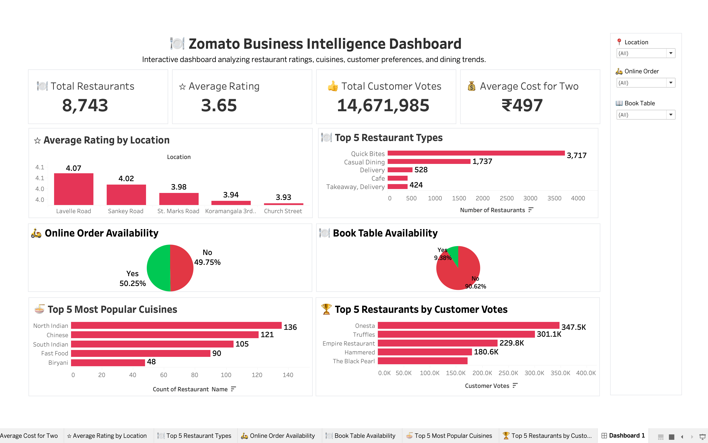
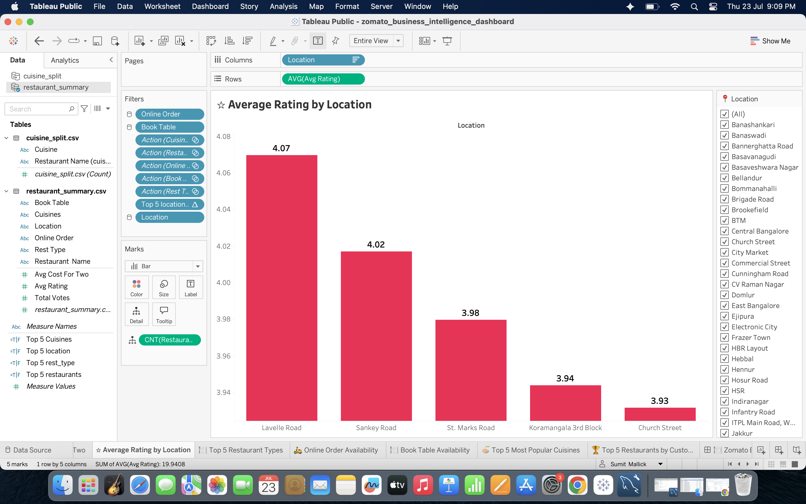
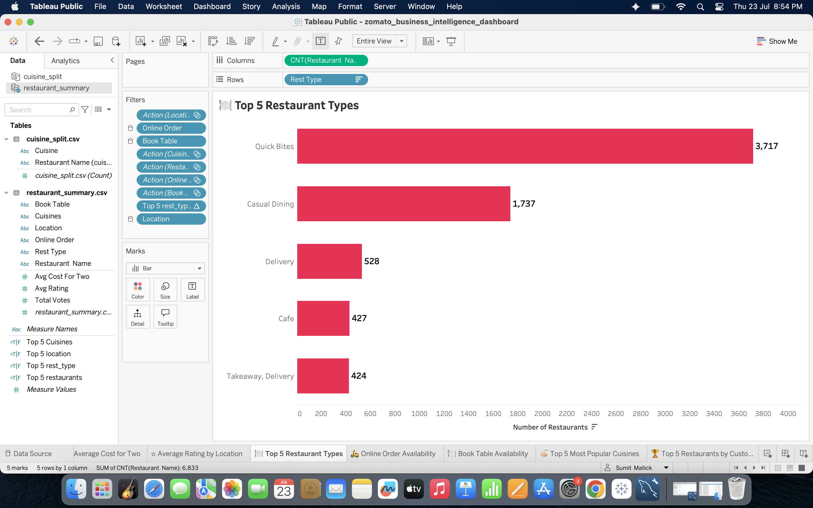
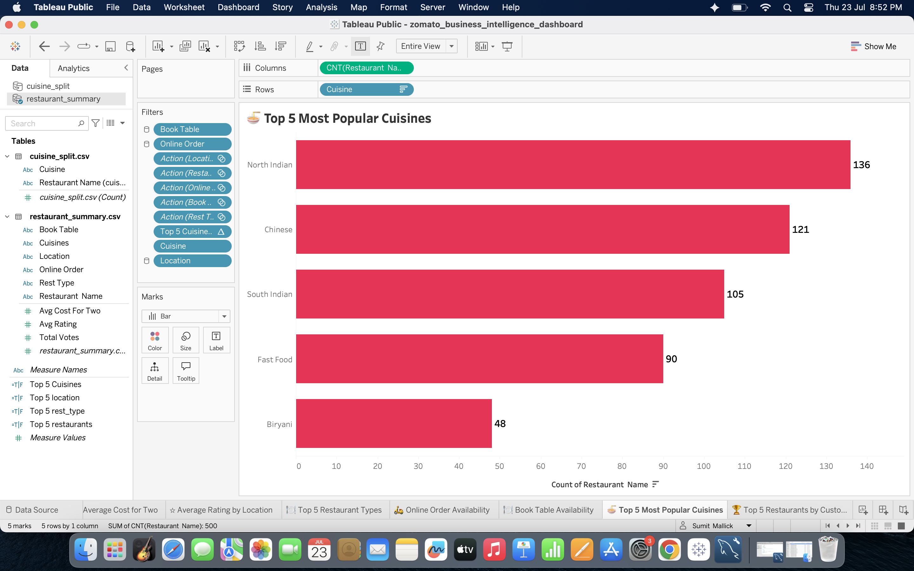
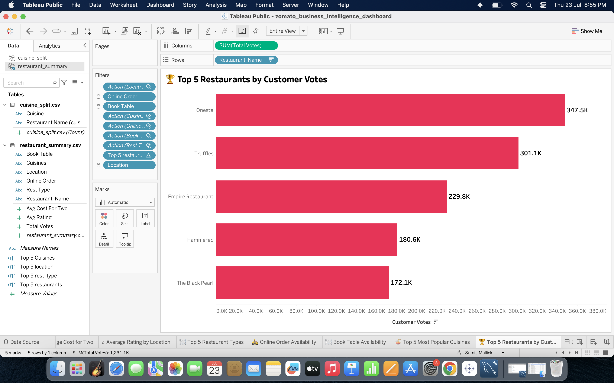

# 🍽️ Zomato Business Intelligence Dashboard
Interactive Business Intelligence Dashboard built using **Tableau**, **SQL**, and **Python** to analyze restaurant performance, customer preferences, ratings, cuisines, online ordering trends, and booking behavior.


---

## 📷 Dashboard Preview



---

## 🎯 Project Overview

This project transforms raw Zomato restaurant data into an interactive Business Intelligence dashboard.

The dashboard helps answer questions like:

- Which locations have the highest restaurant ratings?
- Which restaurant types are most popular?
- Which cuisines dominate the market?
- How many restaurants provide Online Ordering?
- How many restaurants support Table Booking?
- Which restaurants receive the highest customer votes?

---

## 📊 Dashboard KPIs

| KPI | Value |
|------|-------|
| 🍽 Total Restaurants | 8,743 |
| ⭐ Average Rating | 3.65 |
| 👍 Total Customer Votes | 14.67 Million |
| 💰 Average Cost for Two | ₹497 |

---

## 📈 Dashboard Features

- Interactive Filters
- Location-wise Rating Analysis
- Restaurant Type Distribution
- Cuisine Popularity Analysis
- Online Order Availability
- Book Table Availability
- Top Restaurants by Customer Votes
- Clean KPI Cards
- Dynamic Tableau Dashboard

---

## 🛠 Tech Stack

- Tableau Public
- MySQL
- SQL
- Python
- Pandas
- Jupyter Notebook
- GitHub

---

## 📁 Project Structure

zomato-business-intelligence-dashboard/
│
├── Dashboard/
│ └── zomato_business_intelligence_dashboard.twbx
│
├── Dataset/
│ ├── restaurant_summary.csv
│ └── cuisine_split.csv
│
├── Python/
│ └── data_cleaning.ipynb
│
├── SQL/
│ ├── restaurant_summary.sql
│ ├── cuisine_split.sql
│ └── business_queries.sql
│
├── Screenshots/
│ ├── dashboard_overview.png
│ ├── dashboard_filtered_location.png
│ ├── top_cuisines.png
│ ├── top_restaurant_types.png
│ └── customer_votes.png
│
└── README.md

---

## 🧹 Data Cleaning

Data preprocessing was performed in **Python (Pandas)**.

Cleaning included:

- Removing duplicate records
- Handling missing values
- Standardizing column names
- Splitting cuisines
- Preparing dashboard-ready datasets

---

## 🗄 SQL Analysis

SQL was used to perform business analysis including:

- Restaurant Type Distribution
- Cuisine Analysis
- Average Ratings
- Customer Votes
- Cost for Two
- Business Insights

---

## 📊 Dashboard Visualizations

### ⭐ Average Rating by Location



---

### 🍽 Top Restaurant Types



---

### 🍜 Top Cuisines



---

### 👍 Customer Votes



---

## 💡 Key Insights

- Lavelle Road has the highest average restaurant rating.
- Quick Bites dominate the restaurant market.
- North Indian cuisine is the most popular.
- Nearly half of restaurants support Online Ordering.
- Very few restaurants provide Table Booking.
- Onesta receives the highest customer votes.

---

## 🌐 Live Dashboard

🔗 Tableau Public Dashboard

https://public.tableau.com/app/profile/sumit.mallick6538/viz/zomato_business_intelligence_dashboard/ZomatoBusinessIntelligenceDashboard
---

## ⚙️ Installation & Usage

Clone the repository

```bash
git clone https://github.com/Sumit6342/zomato-business-intelligence-dashboard.git

Open

Tableau Workbook (.twbx)
SQL Scripts
Python Notebook

Explore the interactive dashboard.

👨‍💻 Author

Sumit Mallick

GitHub: https://github.com/Sumit6342
LinkedIn: (linkedin.com/in/sumit-mallick-ab96ab253/)
⭐ Support

If you found this project helpful, consider giving it a ⭐ on GitHub.
